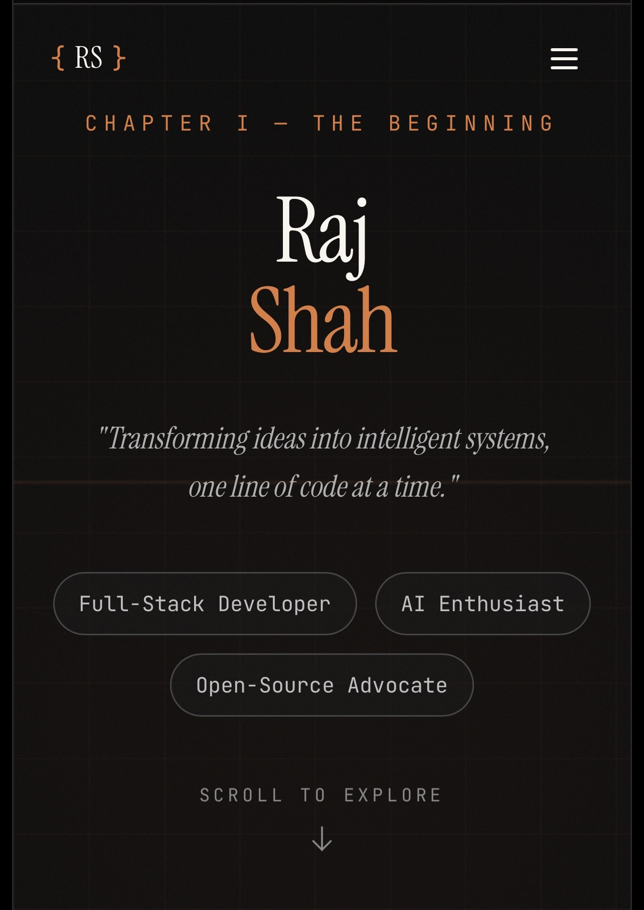

# Raj Shah | The Developer Chronicle

> "Transforming ideas into intelligent systems, one line of code at a time."

A narrative-driven developer portfolio that blends storytelling with technical showcasing. This project features a unique terminal-style boot sequence, immersive interactions, and a "Warm Amber & Charcoal" aesthetic that sets it apart from standard portfolios.

## Storyboard

The portfolio is structured as a chronological journey:
- **Chapter I - The Beginning**: A cinematic boot sequence and hero introduction.
- **Chapter II - The Origin**: Background story and professional mission.
- **Chapter III - The Arsenal**: Interactive skills terminal showcasing technical proficiency.
- **Chapter IV - The Creations**: Highlighted projects with "glitch" aesthetics and detailed cards.
- **Chapter V - The Journey**: A vertical timeline of career milestones and education.
- **Chapter VI - Let's Connect**: Contact section with a functional form UI.

## Key Features

- **Cinematic Boot Sequence**: An engaging initial loading state that mimics a system startup.
- **Immersive Animations**: Powered by **Framer Motion** for smooth transitions, scroll-triggered reveals, and floating elements.
- **Interactive Terminal**: A simulated terminal environment that "types" out skills in real-time.
- **Unified Design System**: Built on a custom "Warm Amber & Charcoal" theme using **Tailwind CSS v4** variables for consistent branding.
- **Responsive & Accessible**: Fully optimized for all device sizes with semantic HTML and accessible color contrast.

## Tech Stack

- **Framework**: [Next.js 16](https://nextjs.org/) (App Router)
- **Language**: [TypeScript](https://www.typescriptlang.org/)
- **Styling**: [Tailwind CSS v4](https://tailwindcss.com/)
- **Animations**: [Framer Motion](https://www.framer.com/motion/)
- **Icons**: [Lucide React](https://lucide.dev/)
- **UI Components**: [Radix UI](https://www.radix-ui.com/) primitives
- **Analytics**: [Vercel Analytics](https://vercel.com/analytics)

-- Designed and developed by RAJ SHAH